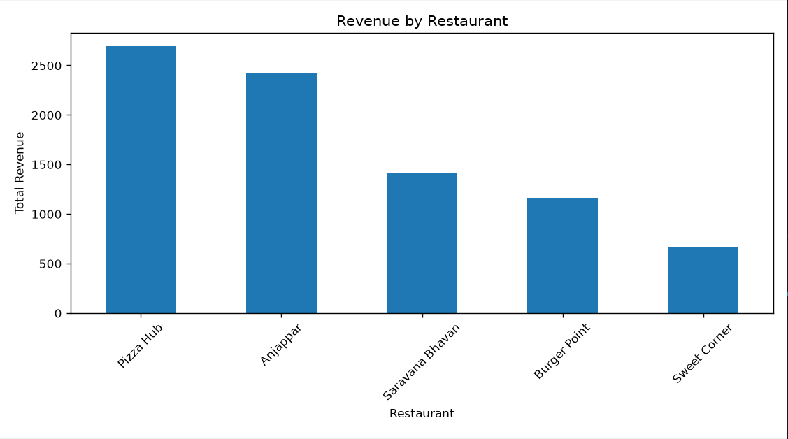
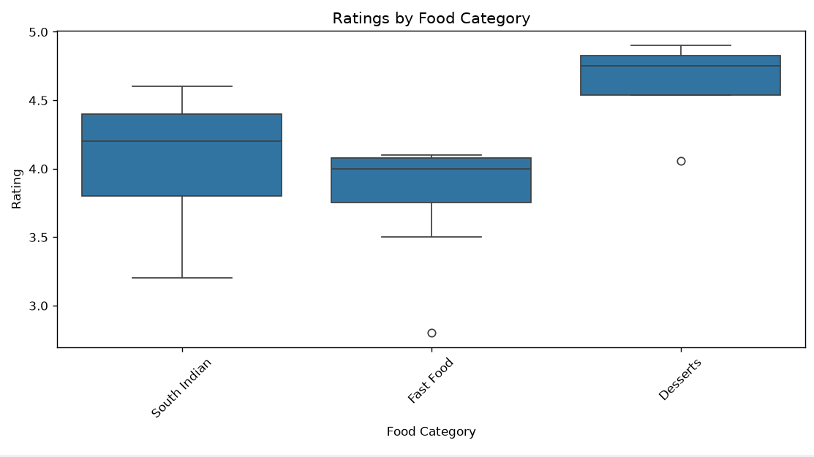
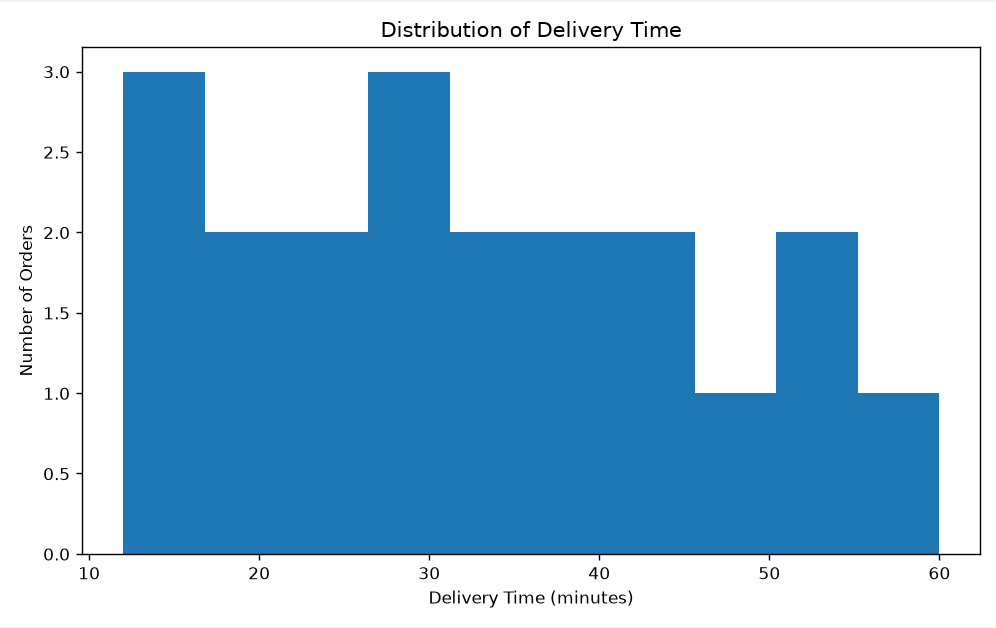
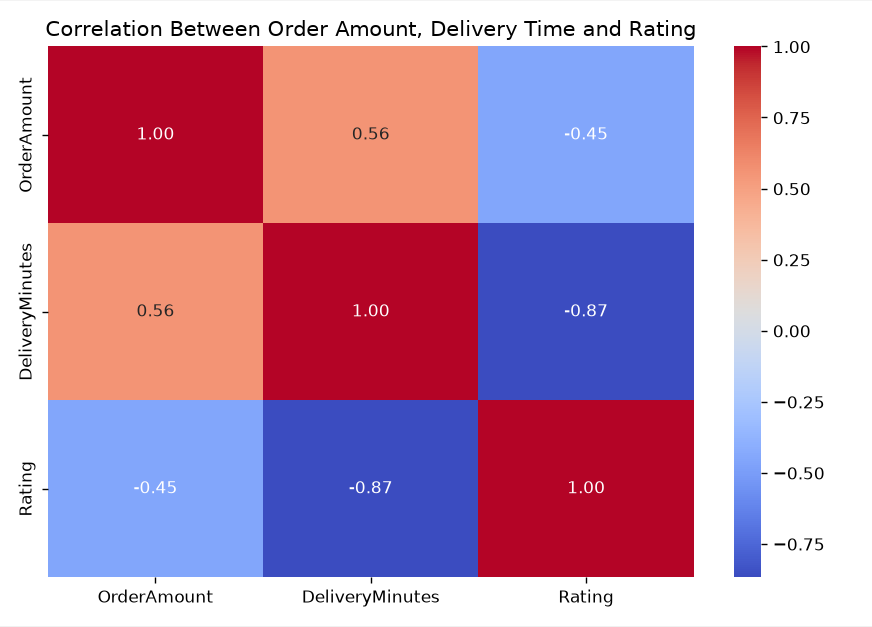

# Food Delivery Order Analysis

## Overview

A Python-based data analysis project exploring food delivery orders across restaurants, food categories, and cities. The project focuses on data cleaning, exploratory analysis, aggregation, and visualization.

## Objectives

* Analyze restaurant revenue and customer ratings
* Examine delivery-time patterns
* Compare performance across food categories and cities
* Identify key trends and insights from the dataset

## Tools & Technologies

**Python | Pandas | NumPy | Matplotlib | Seaborn**

## Data Cleaning

* Checked missing values and duplicate records
* Removed duplicate rows
* Handled missing order amounts using food-category averages
* Handled missing ratings using the overall average
* Created delivery-speed classifications
* Exported the cleaned dataset as `orders_cleaned.csv`

## Analysis & Visualizations

- Restaurant revenue analysis
- Food category rating analysis
- City and category revenue analysis
- Delivery-time analysis
- Correlation analysis

### Visualizations

#### Revenue by Restaurant



#### Ratings by Food Category



#### Delivery Time Distribution



#### Correlation Heatmap



## Key Findings

* **Pizza Hub** generated the highest revenue: **2690**
* **South Indian** had the highest average delivery time: **38.56 minutes**
* **Desserts** had the highest average rating: **4.61**
* Average delivery time across all orders: **33.30 minutes**

## Project Structure

```text
food-delivery-order-analysis/
├── food_orders.csv
├── orders_cleaned.csv
├── food_delivery_analysis.py
├── README.md
└── screenshots/
    ├── correlation_heatmap.png
    ├── ratings_by_category.png
    ├── revenue_by_restaurant.png
    └── delivery_time_distribution.png
```

## How to Run

```bash
pip install pandas numpy matplotlib seaborn
python food_delivery_analysis.py
```

## Skills Demonstrated

**Data Cleaning | EDA | GroupBy Analysis | Statistical Analysis | Data Visualization | Python**
